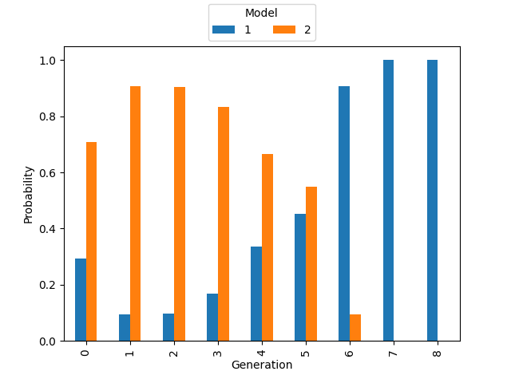

## Using COPASI in pyABC

This project holds a couple of sample scripts, that show how [COPASI](https://copasi.org) simulations can be used in [pyABC](https://pyabc.readthedocs.io/en/latest/).

    
 
### Installation

Checkout the project: 

	git clone https://github.com/fbergmann/pyabc-copasi

Install the requirments (pyabc, python-copasi, basico) in a new virtual environment: 

	cd pyabc-copasi
	pip install -r requirements.txt

### Usage
At the moment the scripts port the [markov jump example](https://pyabc.readthedocs.io/en/latest/examples/chemical_reaction.html) from the pyabc tutorial. It is present twice, once as: 

	* `example_distance_gillespie.py`: this is just copy pasted from the tutorial, and uses the pure python gillespie implementation
	* `example_distance_basico.py`: uses basico to simulate the models included in the `data` directory. 

Running: 

	python example_distance_basico.py

Yields: 

	INFO:Sampler:Parallelizing the sampling on 8 cores.
	INFO:History:Start <ABCSMC id=27, start_time=2021-03-04 10:51:38.388675>
	INFO:ABC:Calibration sample t=-1.
	INFO:Epsilon:initial epsilon is 5.55
	INFO:ABC:t: 0, eps: 5.55.
	INFO:ABC:Acceptance rate: 500 / 1039 = 4.8123e-01, ESS=5.0000e+02.
	INFO:Adaptation:Change nr particles 500 -> 109
	INFO:ABC:t: 1, eps: 2.8.
	INFO:ABC:Acceptance rate: 109 / 305 = 3.5738e-01, ESS=1.0582e+02.
	INFO:Adaptation:Change nr particles 109 -> 85
	INFO:ABC:t: 2, eps: 2.2.
	INFO:ABC:Acceptance rate: 85 / 222 = 3.8288e-01, ESS=4.7117e+01.
	INFO:Adaptation:Change nr particles 85 -> 69
	INFO:ABC:t: 3, eps: 1.95.
	INFO:ABC:Acceptance rate: 69 / 215 = 3.2093e-01, ESS=4.1095e+01.
	INFO:Adaptation:Change nr particles 69 -> 89
	INFO:ABC:t: 4, eps: 1.6028273013884138.
	INFO:ABC:Acceptance rate: 89 / 336 = 2.6488e-01, ESS=4.0208e+01.
	INFO:Adaptation:Change nr particles 89 -> 95
	INFO:ABC:t: 5, eps: 1.45.
	INFO:ABC:Acceptance rate: 95 / 419 = 2.2673e-01, ESS=3.8843e+01.
	INFO:Adaptation:Change nr particles 95 -> 87
	INFO:ABC:t: 6, eps: 1.25.
	INFO:ABC:Acceptance rate: 87 / 417 = 2.0863e-01, ESS=4.5705e+01.
	INFO:Adaptation:Change nr particles 87 -> 93
	INFO:ABC:t: 7, eps: 0.85.
	INFO:ABC:Acceptance rate: 93 / 474 = 1.9620e-01, ESS=5.8819e+01.
	INFO:Adaptation:Change nr particles 93 -> 57
	INFO:ABC:t: 8, eps: 0.7.
	INFO:ABC:Acceptance rate: 57 / 387 = 1.4729e-01, ESS=5.5188e+01.
	INFO:Adaptation:Change nr particles 57 -> 48
	INFO:pyabc.util:Stopping: minimum epsilon.
	INFO:History:Done <ABCSMC id=27, duration=0:00:32.578834, end_time=2021-03-04 10:52:10.967509>

as well as images as these ones: 

	

Which matches what was found in the original example. Sometimes the it doesn't work and stops with: 

	pyabc.transition.exceptions.NotEnoughParticles: Fitting not possible.

in that case you just run it again. 	

### License

The packages available on this page are provided under the 
[Artistic License 2.0](http://copasi.org/Download/License/), 
which is an [OSI](http://www.opensource.org/) approved license. This license 
allows non-commercial and commercial use free of charge.
 
